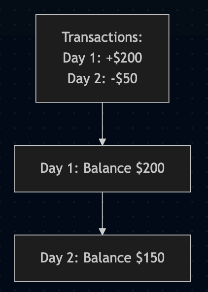
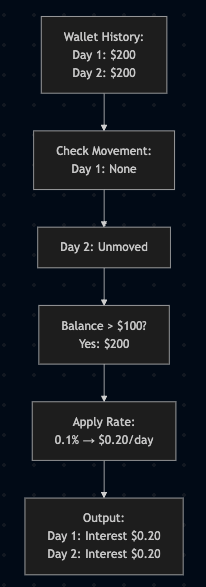

# CDI Bonus Pipeline: Functional Documentation

This document explains the business logic of the CDI Bonus pipeline, which calculates daily interest for user wallet balances. It covers three key components: ingesting data, building wallet history, and calculating interest.

## Overview
The pipeline processes wallet transaction data to:
- **Ingest Transaction Data**: Loads user transaction records.
- **Build Wallet History**: Tracks daily balances for each user.
- **Calculate Interest**: Pays 0.1% daily interest on balances over $100 that remain unmoved for 24 hours.

## 1. Ingesting Transaction Data (`ingest_cdc.py`)

### Purpose
This component loads raw transaction data (Change Data Capture, or CDC) from a storage location, ensuring the data is ready for processing.

### Business Logic
- **What It Does**: Reads transaction records, which include details like user ID, transaction date, amount, and type (e.g., deposit, withdrawal).
- **Validation**: It makes sure the data has all required fields (e.g., user ID, transaction date, amount, type) and removes any invalid entries.
- **Transformation**:
  - Converts the transaction date into a proper date format (e.g., "2025-05-01").
  - Adjusts the amount to a numerical format for calculations.
- **Output**: A clean list of transactions with essential fields for further processing.

### Example
- **Input**: A transaction record: User 1 deposits $200 on "2025-05-01 10:00:00".
- **Output**: A cleaned record: User 1, Date: "2025-05-01", Amount: $200, Type: "DEPOSIT".

## 2. Building Wallet History (`build_history.py`)

### Purpose
This component creates a daily record of each user’s wallet balance over time, based on their transactions.

### Business Logic
- **What It Does**: Takes the cleaned transaction data and calculates the balance for each user every day.
- **Calculation**:
  - Starts with a balance of $0 for each user.
  - For each day, adds or subtracts the transaction amounts (e.g., deposits increase the balance, withdrawals decrease it).
  - Keeps a running total of the balance for each user, day by day.
- **Output**: A table showing each user’s balance for every day they had a transaction.

### Example
- **Input Transactions**:
  - Day 1: User 1 deposits $200.
  - Day 2: User 1 withdraws $50.
- **Output**:
  - Day 1: User 1, Balance: $200.
  - Day 2: User 1, Balance: $150 ($200 - $50).

### Diagram: Wallet History Creation

## 3. Calculating Interest (`calculate_interest.py`)

### Purpose
This component calculates a daily 0.1% interest on user wallet balances that are over $100 and have not moved (no withdrawals or transfers out) for 24 hours, then combines these interest payments with the original transactions.

### Business Logic
- **Step 1: Load Interest Rates**:
  - Tries to load daily interest rates from a file (e.g., "0.002" for 0.2% on a specific day).
  - If rates are unavailable, uses a default rate of 0.1% (0.001).
- **Step 2: Identify Movements**:
  - Looks at transactions to find days with withdrawals or transfers out.
  - Marks those days as "having movement."
- **Step 3: Check for Unmoved Balances**:
  - For each user, checks if the previous day had no movement (no withdrawals or transfers out).
  - If there was no movement, the balance is considered "unmoved" for the current day.
- **Step 4: Filter Qualifying Balances**:
  - Selects balances over $100 that are unmoved for 24 hours (based on the previous day’s status).
- **Step 5: Apply Interest Rate**:
  - Multiplies the qualifying balance by the daily rate (e.g., $200 * 0.001 = $0.20 interest).
- **Step 6: Combine Transactions**:
  - Merges the interest payments with the original transactions into a single table.
- **Step 7: Save Results**:
  - Saves the combined table, organized by date, for querying.

### Example
- **Input**:
  - Wallet History: Day 1: User 1, Balance $200; Day 2: User 1, Balance $200.
  - Transactions: Day 1: User 1 deposits $200 (no withdrawals on Day 1).
  - Rates: Default rate 0.1% (0.001).
- **Process**:
  - Day 1: No previous day, assume unmoved. Balance $200 > $100 → Interest: $200 * 0.001 = $0.20.
  - Day 2: No movement on Day 1. Balance $200 > $100 → Interest: $200 * 0.001 = $0.20.
- **Output**:
  - Transactions: Day 1: User 1, Deposit $200; Day 1: User 1, Interest $0.20; Day 2: User 1, Interest $0.20.

### Diagram: Interest Calculation Flow
