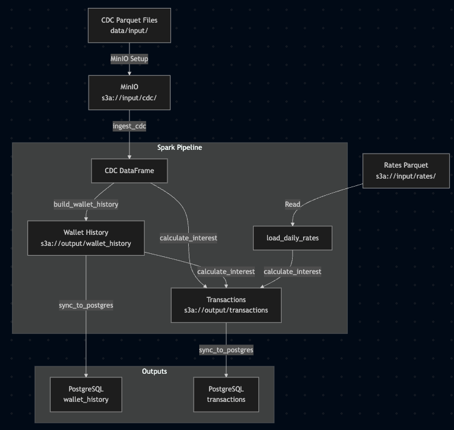

# CDI Bonus Data Challenge

This repository implements a data product for calculating the CDI Bonus, a daily interest payout for user wallet balances above $100 that remain unmoved for 24 hours, as per the CDI Bonus Assignment.

## Overview
- **Objective**: Process CDC data, build a wallet history, calculate daily interest, and provide queryable outputs.
- **Technologies**: Apache Spark 3.5.3, Delta Lake 3.2.0, MinIO, PostgreSQL, Docker.
- **Pipeline**:
  - Ingests CDC Parquet files from `s3a://input/cdc/`.
  - Builds a daily wallet history (`s3a://output/wallet_history`).
  - Calculates 0.1% daily interest on qualifying balances, merged into `s3a://output/transactions`.
  - Syncs tables to PostgreSQL for interactive querying.

## Data Flow
The following diagram illustrates how data moves from input Parquet files to the final tables:




- **Inputs**: CDC Parquet files (`data/input/`) and rates (`s3a://input/rates/`).
- **Processing**: Spark pipeline (`ingest_cdc`, `build_wallet_history`, `calculate_interest`, `sync_to_postgres`).
- **Outputs**:
  - Delta tables: `wallet_history` (daily balances), `transactions` (CDC + interest, primary output).
  - PostgreSQL: Temporary copies of `wallet_history` and `transactions` for querying.
- **Schema**: The `transactions` table includes `user_id`, `date`, and `interest_amount`.

## Local Setup

### Clone the Repository
```bash
git clone git@github.com:nsoria1/rpay-data-challenge.git
cd rpay-data-challenge
```

### Requirements
- Bash
- Docker
- Docker Compose
- Python 3.13

### Folder Structure
```
├── data/input/          # Place CDC Parquet files here
├── minio-data/         # MinIO storage
├── logs/               # Pipeline logs
├── src/                # Pipeline scripts (main.py, ingest_cdc.py, etc.)
├── tests/              # Pytest scripts
├── exploratory_analysis/  # Jupyter notebooks for EDA
├── docker-compose.yml
├── Dockerfile
├── requirements.txt
├── TRADEOFFS.md
├── README.md
```

### Setup and Run
1. **Prepare MinIO Folders**:
   ```bash
   mkdir -p minio-data/input minio-data/output
   ```

2. **Place CDC Parquet Files**:
   - Copy Parquet files to `data/input/`.

3. **Run Pipeline**:
   ```bash
   docker-compose up --build -d
   ```
   - Logs: `./logs/pipeline.log`
   - Spark UI: http://localhost:4040
   - MinIO Console: http://localhost:9001 (user: admin, password: password)
     - Wallet history: `s3://output/wallet_history`
     - Transactions: `s3a://output/transactions`

4. **Query Results**:
   - Connect to PostgreSQL:
     ```bash
     psql -h localhost -p 5432 -U admin -d cdi_bonus
     ```
     Password: `password`
   - Example queries:
     ```sql
     -- High-value transactions
     SELECT * FROM transactions WHERE interest_amount > 100;

     -- Stable balances for interest
     -- Identifies wallet balances > $100 that remain unchanged for 24+ hours,
     -- qualifying for CDI Bonus interest (no withdrawals or transfers out).
     SELECT w1.user_id, w1.balance, w1.date
     FROM wallet_history w1
     WHERE w1.balance > 100
     AND NOT EXISTS (
        SELECT 1
        FROM wallet_history w2
        WHERE w2.user_id = w1.user_id
        AND w2.date > w1.date
        AND w2.date <= w1.date + INTERVAL '24 hours'
        AND w2.balance != w1.balance
     );

     -- All transactions (CDC + interest)
     SELECT user_id, date, interest_amount FROM transactions LIMIT 10;
     ```

5. **Stop or Reset**:
   ```bash
   docker-compose down
   ```
   To reset MinIO data:
   ```bash
   docker-compose down -v
   ```

### Exploratory Data Analysis
To explore CDC data:
```bash
python3 -m venv .venv
source .venv/bin/activate
pip install --upgrade pip
pip install -r requirements.txt
```
Open `exploratory_analysis/` in Jupyter or VS Code.

## Pipeline Logic
- **ingest_cdc.py**: Loads and validates CDC data (`event_time`, `user_id`, `amount`, `transaction_type`).
- **build_wallet_history.py**: Aggregates daily balances per user, saved as a Delta table.
- **calculate_interest.py**: Applies 0.1% interest (or daily rates from `s3a://input/rates/`) to balances > $100 unmoved for 24 hours. Merges CDC and interest transactions.
- **sync_to_postgres.py**: Copies Delta tables to PostgreSQL for querying.
- **main.py**: Orchestrates the pipeline.

## Design Choices
- **Spark**: Used for scalability and Delta Lake for reliable storage.
- **MinIO**: Simulates S3 for local development.
- **PostgreSQL**: Temporary queryable copy of Delta tables, replacing Jupyter for reliability.
- **Transactions Schema**: Uses `user_id`, `date`, `interest_amount` for consistency.
- **Logging**: Detailed logs in `./logs/pipeline.log` for visibility.

## Requirements Mapping
- **Functional**:
  - Wallet History: `build_wallet_history.py` creates `wallet_history` table from CDC data.
  - Interest Calculation: `calculate_interest.py` applies 0.1% interest to balances > $100 unmoved for 24 hours.
  - Interest Rate: Supports daily rates via `s3a://input/rates/`, defaults to 0.001.
  - Time Frame: Processes daily data (00:00 to 23:59), though scheduling is manual (see `TRADEOFFS.md`).
  - Daily Payout: Interest transactions are merged into `transactions` table.
- **Non-Functional**:
  - Mission-Critical: Logging ensures visibility; further monitoring deferred (see `TRADEOFFS.md`).
  - Documentation: Pipeline logic, setup, and queries detailed above; trade-offs in `TRADEOFFS.md`.
- **Technical**:
  - Spark: Used for all data processing and Delta table writes.
  - Testing: Basic test in `tests/test_interest.py` verifies interest calculation, plus other unit tests as well.

## Trade-offs
See `TRADEOFFS.md` for compromises due to time constraints, including monitoring, error handling, and security.